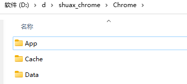
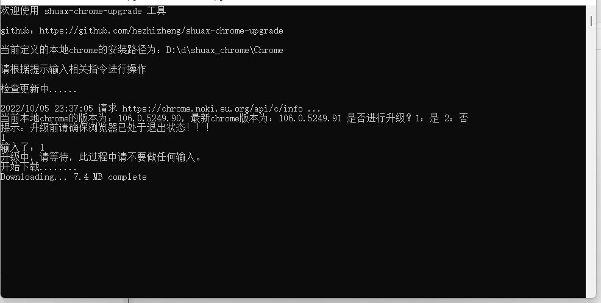
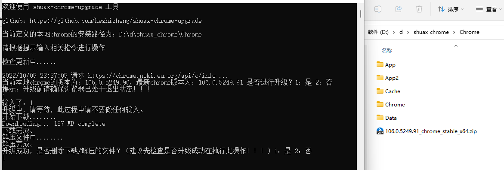
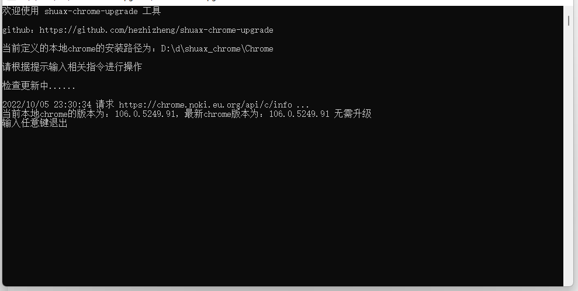

## shuax-chrome-upgrade

> 一个可以升级 [shuax chrome 便携版](https://shuax.com/project/chrome/)  的工具

> [github](https://github.com/hezhizheng/shuax-chrome-upgrade)

### 功能
- 简单交互式操作
- 自动检测最新的 `shuax chrome` 版本
- 用户决定是否进行升级操作(自动下载、解压、重命名文件等)
- windows下 配合.bat文件 实现开机自动检测更新功能

### 流程


### 使用
自定义config.json配置文件(shuax chrome 的安装目录)

例：假如我的shuax chrome 安装解压目录为


那么 local_chrome_path 就定义为 `D:\d\shuax_chrome\Chrome`。如下：
```
# 参数说明
{
  "comments": {
    "comment1": "// 这些是注释不用理会，local_chrome_path：本地chrome安装路径",
    "comment2": "// proxy_url： 下载代理，检查最新版本跟下载可能需要翻墙，如程序有错误抛出，请尝试使用代理解决(不使用代理则无需配置该项，或者设置为空字符串)。",
    "comment3": "http://127.0.0.1:7890"
  },
  "app": {
    "local_chrome_path": "D:\\d\\shuax_chrome\\Chrome"
    ,"proxy_url": "http://127.0.0.1:7890"
  }
}
```

编译 (提供编译好的文件 shuax-chrome-upgrade.7z
下载 [releases](https://github.com/hezhizheng/shuax-chrome-upgrade/releases) )

手动编译
```
go build
```

运行
- 请不要随意更改`shuax chrome`原本的目录结构
- 保证编译的文件与 config.json、7z.dll、7z.exe 文件 在同级目录
- 执行 ./shuax-chrome-upgrade.exe 或者双击启动，根据提示输入指令完成升级

升级





无需升级



windows 开机自动检测(创建.bat文件)

[./shuax-chrome-upgrade.bat](./shuax-chrome-upgrade.bat)

创建快捷方式，设定开机自启即可